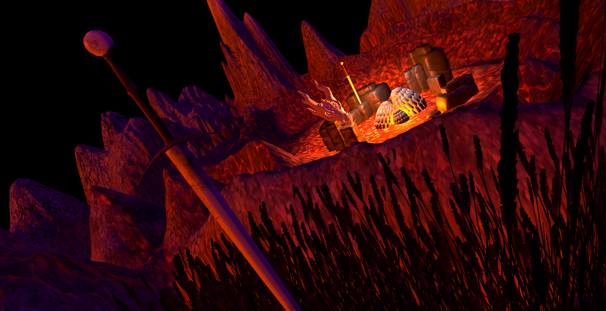
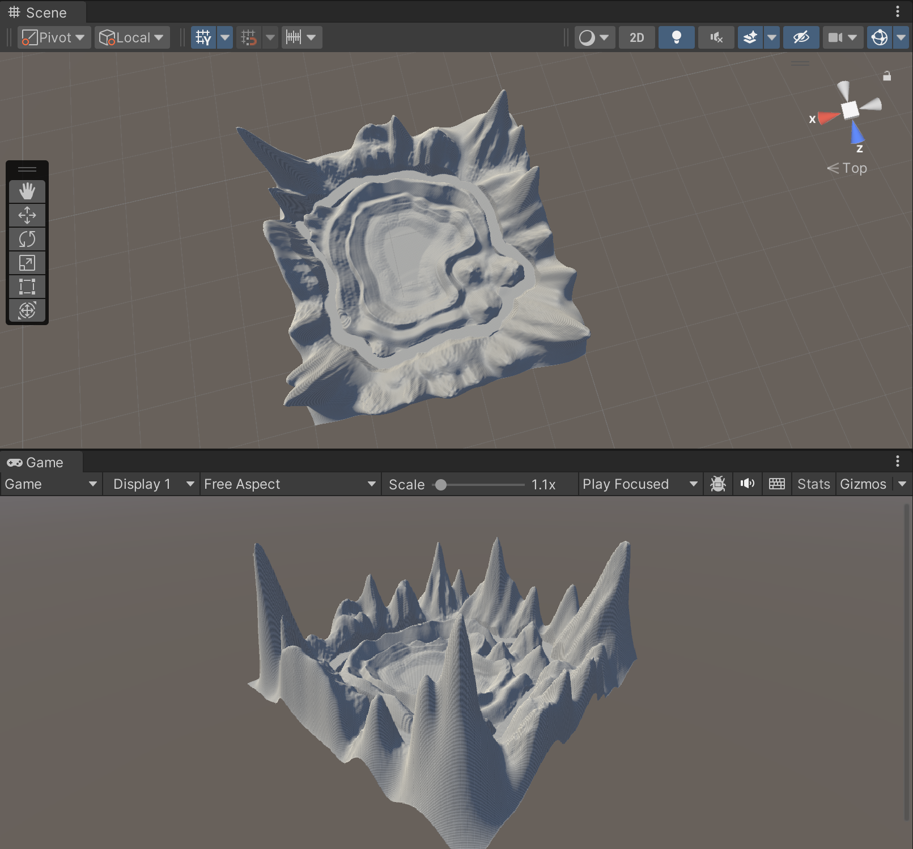
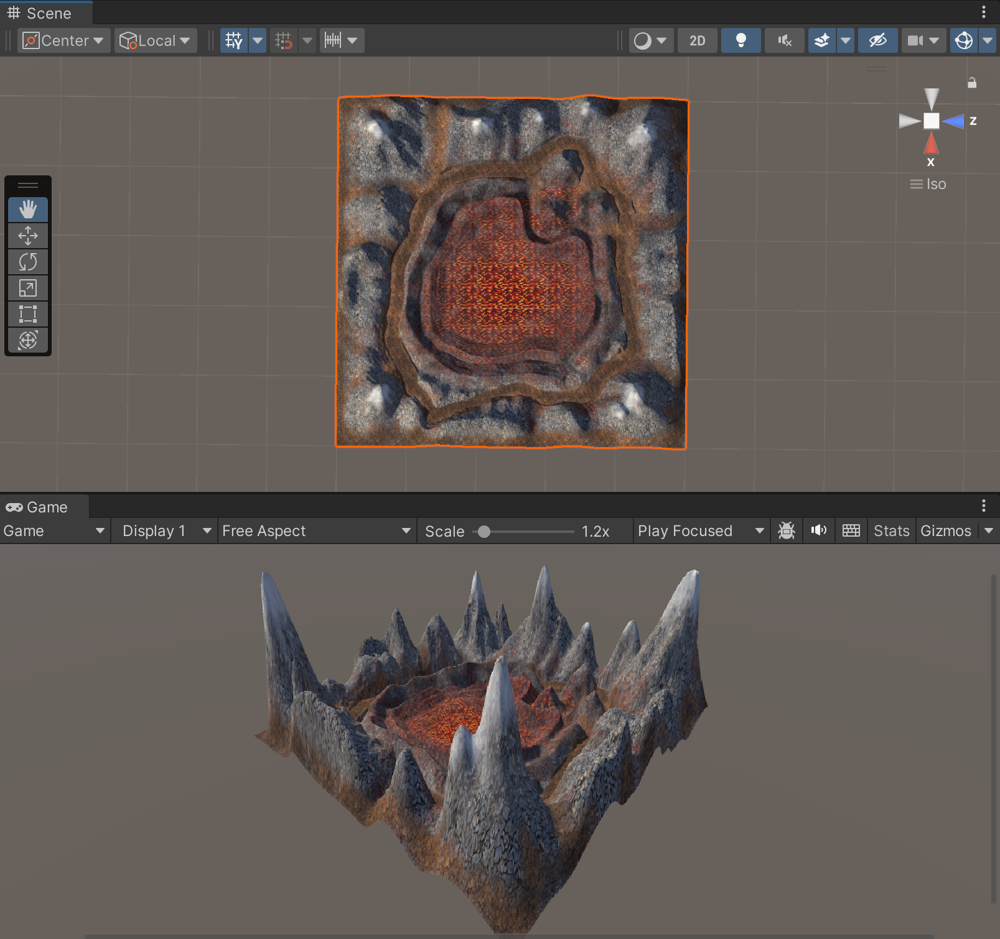
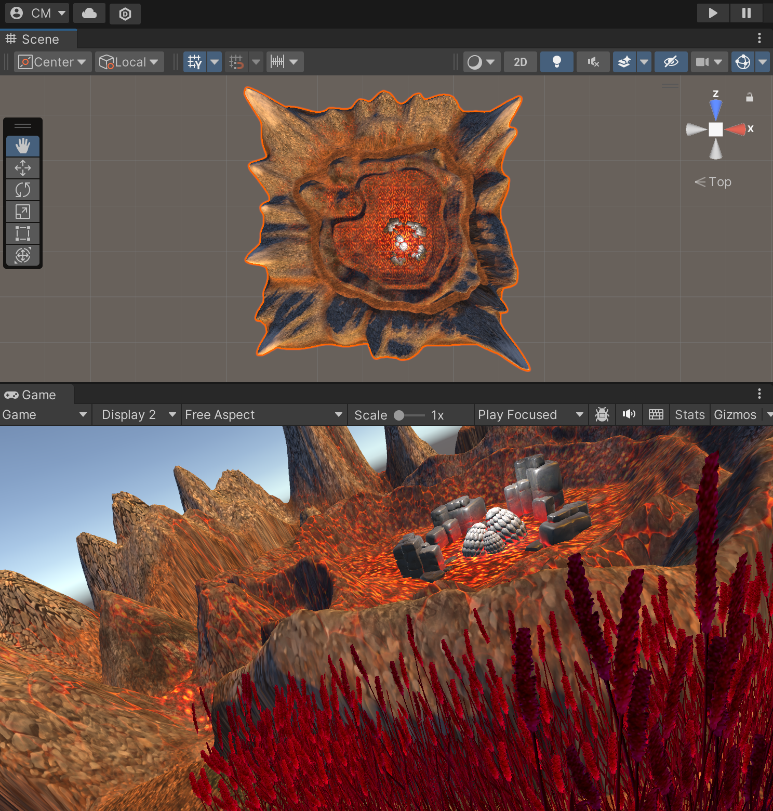
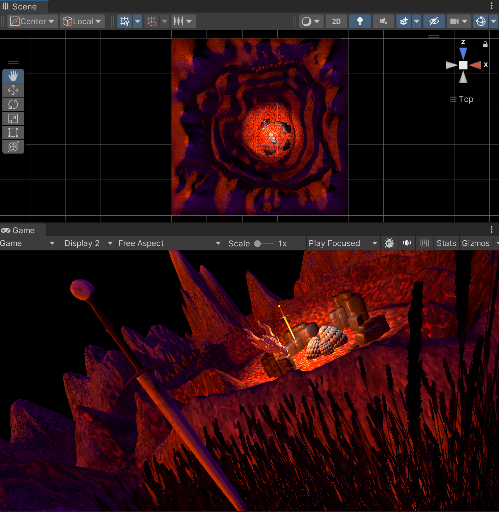

# Taller 1: Terrenos y Cubos en Unity
Creación de un terreno en Unity 3D con la temática de un nido de dragones.

# Paquete de texturas y materiales utilizados
[Stylized Nature Textures](https://assetstore.unity.com/packages/2d/textures-materials/stylized-nature-textures-228680)
[Grass Flowers Pack Free](https://assetstore.unity.com/packages/2d/textures-materials/nature/grass-flowers-pack-free-138810)
# Modelos 3D
[blocky Rocks](https://sketchfab.com/3d-models/blocky-rocks-cea1b61f14e34588b33196de72af8983)
[Dragon Egg (House of the Dragon)](https://sketchfab.com/3d-models/dragon-egg-house-of-the-dragon-c1230f37fc42432eb45190a46e379a23)
[Sword](https://sketchfab.com/3d-models/sword-07463a2658e04d6ab8a42b5639a35d63)
[Skyrim Dragon Skull](https://sketchfab.com/3d-models/skyrim-dragon-skull-68773ed4e7de43ec8cb25c2f29a79602)
# Progreso

