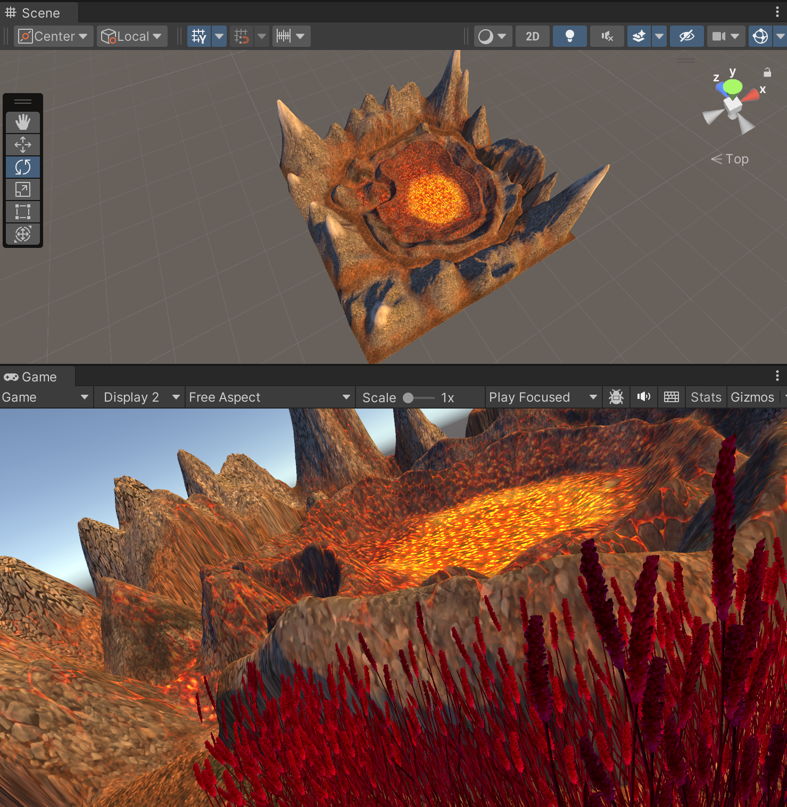

# Taller 1: Terrenos y Cubos en Unity
Creación de un terreno en Unity 3D con la temática de un nido de dragones.

# Paquete de texturas y materiales utilizados
[Stylized Nature Textures](https://assetstore.unity.com/packages/2d/textures-materials/stylized-nature-textures-228680)
[Grass Flowers Pack Free](https://assetstore.unity.com/packages/2d/textures-materials/nature/grass-flowers-pack-free-138810)

# Progreso

